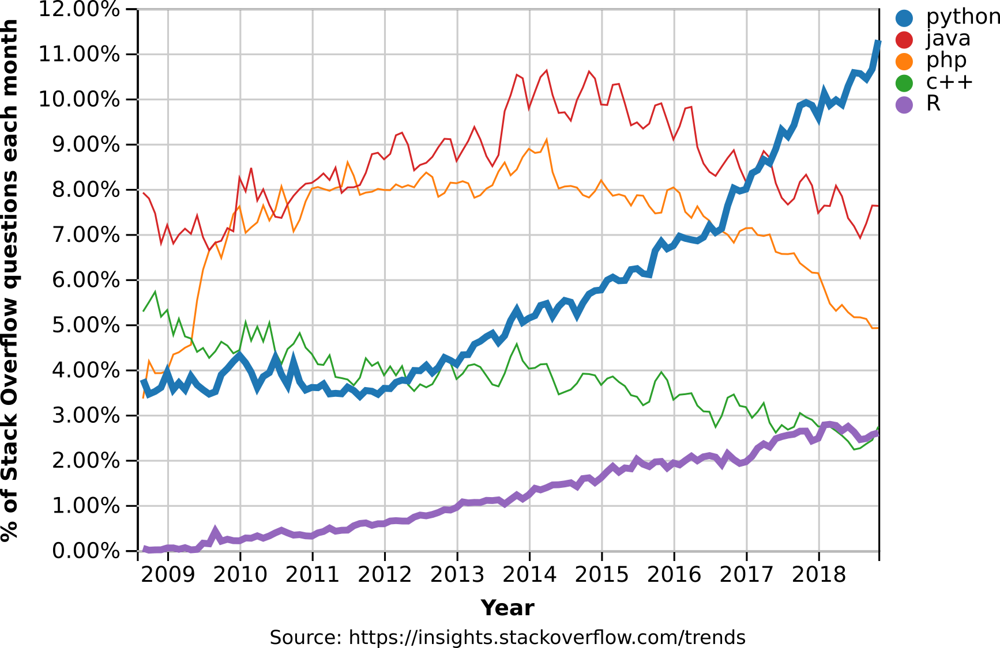
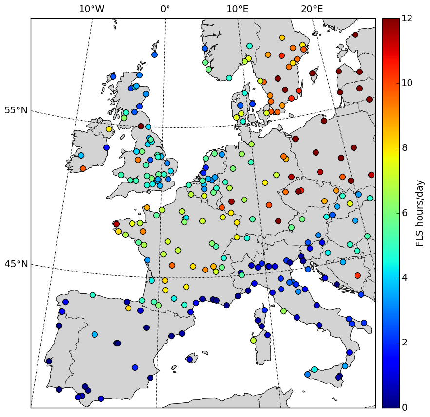

---
redirect_from:
  - "/units/s01e01"
interact_link: content/units/S01E01.ipynb
kernel_name: python3
title: 'Unit 2'
prev_page:
  url: /units/S01E00
  title: 'Unit 1'
next_page:
  url: /units/S01E02
  title: 'Unit 3'
comment: "***PROGRAMMATICALLY GENERATED, DO NOT EDIT. SEE ORIGINAL FILES IN /content***"
---


# Session 1: Introduction & Orga

## Lecturers

- Benjamin Roesner: benjamin.roesner@geo.uni-marburg.de
- Sebastian Egli:   sebastian.egli@geo.uni-marburg.de

## Why coding?


Coding enables you to...
- automate your processes,
- work efficiently (especially with large data sets),
- do exactly what you want to do!

## Why Python?



> Python is an unusual case for being both one of the **most visited** tags on Stack Overflow and one of the **fastest-growing** ones. (Incidentally, it is also accelerating! Its year-over-year growth has become faster each year since 2013). Source: [StackOverflow Blog](https://stackoverflow.blog/2017/09/06/incredible-growth-python/)

Python...
- is beginner friendly,
- flexible,
- readable,
- has a big onliny community,
- is a first-class tool for scientific computing tasks, including the analysis and visualization of large datasets,
- is used in
    - Remote Sensing
    - Machine Learning
    - Big Data
    - Image Processing
    - Data Analysis
    - Data Visualization


- is the 2nd most demanded programming skill (in the US)
- is the 2nd best paid programming skill (> 105'000$ in the US)
- is heavily used at large companies like Google & Facebook but also at NASA, ESA, EUMETSAT, etc.

----------

## Aim of the course

**At the end of this course you will be able to...**

**... work with the basic concepts of Python:**


{:.input_area}
```python
print("Hallo Welt!")
```


{:.output .output_stream}
```
Hallo Welt!

```

**... use standard Python tools for data science (numpy, scipy, pandas, matplotlib):**


{:.input_area}
```python
import numpy as np
import matplotlib.pyplot as plt

plt.plot(np.linspace(0,10,100),np.random.random(100)+np.linspace(0,3,100))
plt.show()
```


{:.output .output_png}


**... visualize your data in map plots:**



**... read, manipulate and visualize meteorological satellite data (e.g. Meteosat):**


---
## Organizational matters

- **3 ECTS** credits are awarded for successfully completing this course.
- Course materials are made available on the **OER-Marburg** platform: https://oer.uni-marburg.de/ [LINK vervollständigen]
- Weekly exercises are distributed via **github classroom** and must also be submitted there.
- To pass the course, at least **50%** of the weekly exercises must have been correctly completed.

## Software requirements

- [Python 3](https://www.python.org/downloads/)

- [git](https://git-scm.com/)
    - open git BASH and enter the following commands:
    
    `git config --global user.name 'Firstname Lastname'`

    `git config --global user.email 'your@email.com'`

    `git config --global --list`


- [Spyder](https://www.spyder-ide.org/) (or another IDE of your choice)
- [miniconda](https://docs.conda.io/en/latest/miniconda.html)

## GitHub Classroom

- Create an account at github.com: https://github.com/
    - Plan: Free
    - Verify email address
    - Accept first assignment: https://classroom.github.com/a/N1mDL3m7
    - Clone (download) the assigned repository to your local machine: 
    
    `git clone https://github.com/python-kurs/exercise-1-[yourname].git`

---

## Exercise 1

- Complete the first assignment and push your results until tuesday 14:00 next week
